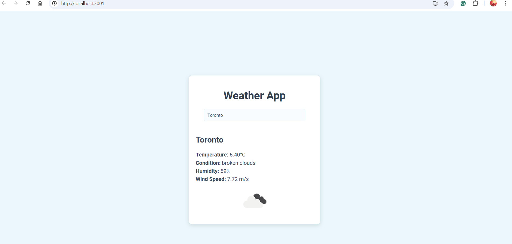
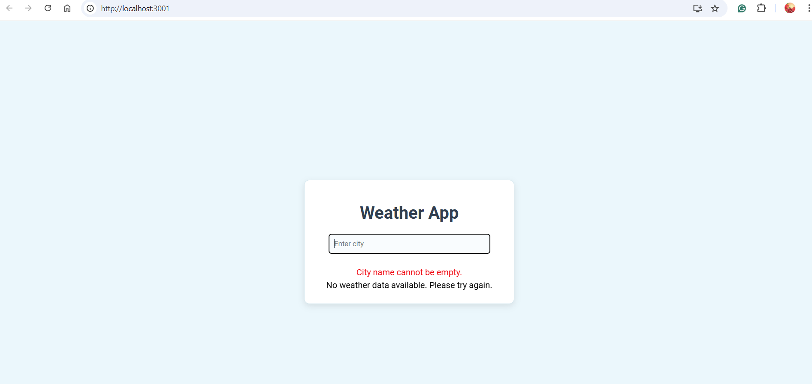
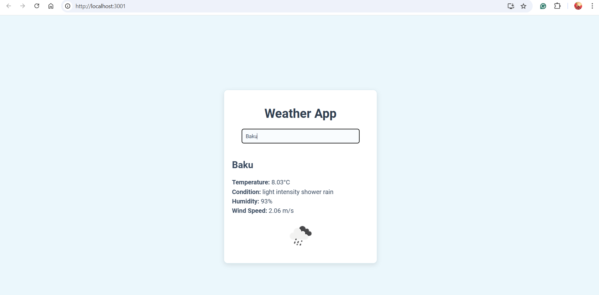
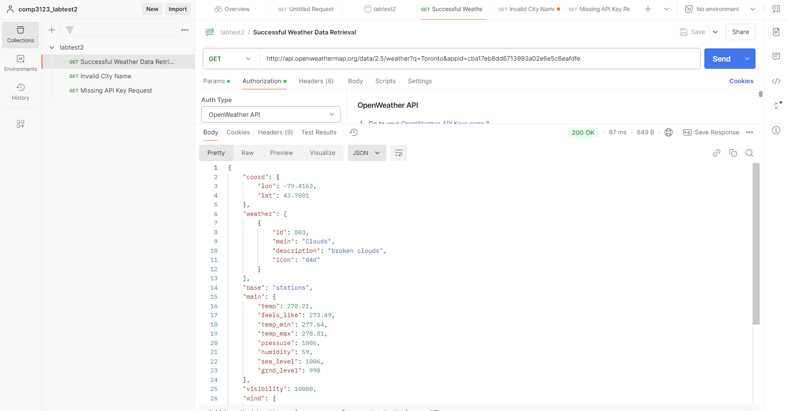
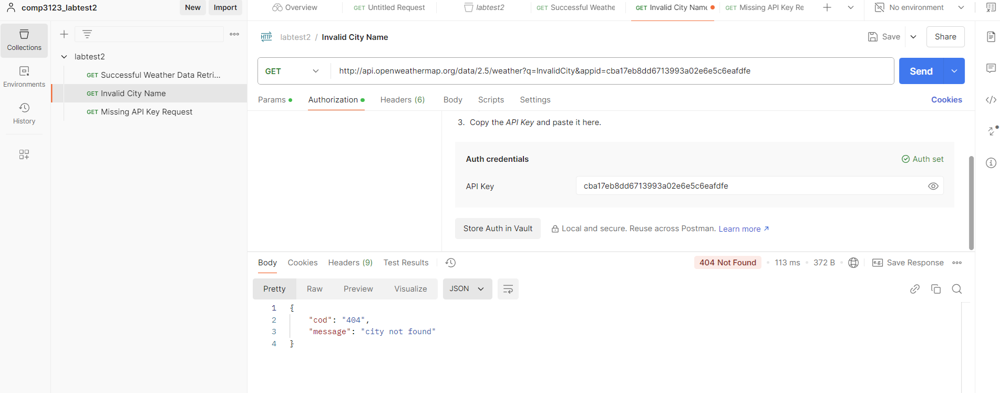
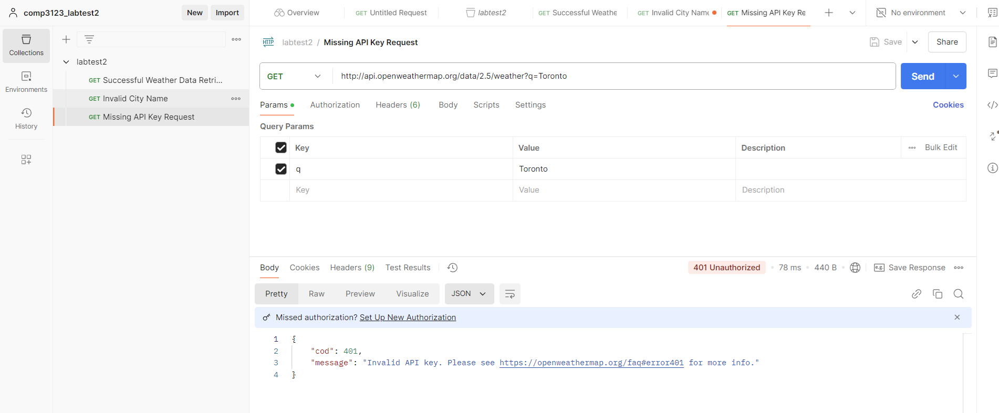

# Getting Started with Create React App

This project is a simple weather application built with ReactJS and powered by the OpenWeatherMap API.

## Available Scripts

In the project directory, you can run:

### `npm start`

Runs the app in the development mode.\
Open [http://localhost:3001](http://localhost:3001) to view it in your browser.

### Features:
    ## Search weather information by city name.
    ## Real-time weather data including:
        # City name;
        # Temperature in Celsius;
        # Weather condition (e.g., clear sky, clouds);
        # Humidity percentage;
        # Wind speed in m/s.
    ## OpenWeatherMap weather icons for easy visualization.
    ## Input validation for blank or invalid city names.
    ## Error handling for missing API keys or failed requests.

## This app integrates with the OpenWeatherMap API to fetch real-time weather data.

## API Call: http://api.openweathermap.org/data/2.5/weather?q=Toronto&appid=cba17eb8dd6713993a02e6e5c6eafdfe

## GitHub Link: https://github.com/Nigar0826/101431281_comp3123_labtest2

## Screenshots

### Main Weather App Interface

### Detailed Weather Information

### Dynamic Search Results

---

### Postman API Tests

#### Successful Retrieval

#### Invalid City Name

#### Missing API Key

